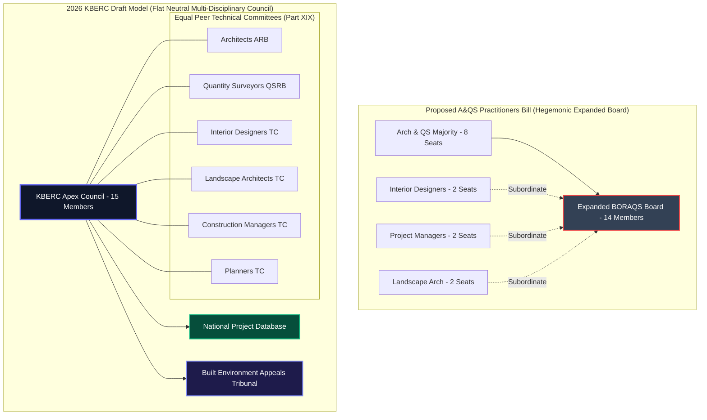

# Architectural and Quantity Surveying Practitioners Bill vs 2026 KBERC Draft: An Exhaustive Comparative Study

## 1. Deep Dive: The Modernization Compromise & The Hegemony Conflict

### 1.1 The Genesis of the Practitioners Bill (2021–2026)
By the early 2020s, it was universally recognized by Parliament, the Ministry of Lands, Public Works, Housing and Urban Development, and professional societies that the 1934 *Architects and Quantity Surveyors Act (Cap. 525)* was severely obsolete[^1]. Cap 525 legally recognized only two professions—Architects and Quantity Surveyors—leaving critical allied disciplines operating in a dangerous legal vacuum[^2].

To prevent the total dissolution of their regulatory authority, the **Board of Registration of Architects and Quantity Surveyors (BORAQS)**, in consultation with the Architectural Association of Kenya (AAK) and the Institute of Quantity Surveyors of Kenya (IQSK), drafted **The Architectural and Quantity Surveying Practitioners Bill (2026 Draft)**[^1][^3]. 

The Practitioners Bill was designed as an establishment "modernization compromise": it proposed repealing Cap 525 while preserving the historical joint-board structure (BORAQS)[^4]. To resolve the regulatory vacuum, the Bill proposed expanding BORAQS into the **Architecture and Quantity Surveying Practitioners Board**, legally absorbing:
- Landscape Architects
- Interior Designers
- Construction Project Managers (CPMs)
- Architectural & QS Technicians / TVET Diploma holders[^1][^2].

### 1.2 The Allied Revolt & The "Regulatory Hegemony" Conflict
This expansion proposal met fierce resistance from allied professional bodies, particularly the **Interior Designers Association of Kenya (IDAK)**, the **Kenya Society of Environmental & Landscape Architects (KSELA)**, and the **Association of Construction Project Managers (ACMK)**[^3].

The allied disciplines submitted formal parliamentary memoranda arguing against the Practitioners Bill on grounds of **Regulatory Hegemony**[^3]:
> *"The proposed Practitioners Bill is a protectionist attempt by senior Architects and Quantity Surveyors to maintain statutory dominance. Under the proposed board voting structure, traditional Architects and QS hold 8 out of 14 seats, while Interior Designers and Project Managers are granted only 1 or 2 subordinate seats. We refuse to be placed 'under the armpit' of a board where senior Architects dictate our university syllabi, fee scales, and disciplinary outcomes."*

### 1.3 The State's Decision: KBERC's Flat-Hierarchy Model
The **2026 KBERC Draft** rejected the Practitioners Bill's expanded joint-board model. The State concluded that expanding BORAQS into a multi-discipline board while retaining Architect/QS voting dominance would entrench professional class systems and prolong inter-disciplinary conflict.

Instead, KBERC introduced a **Flat-Hierarchy Primary Regulator Model**:
1. **Total Abolition of BORAQS**: Cap 525 is repealed without preserving BORAQS's joint-board structure (Part XIX).
2. **Neutral Apex Council**: Establishes the 15-member **Kenya Built Environment Regulatory Council (KBERC)**, where all 8 professions (Architects, QS, Engineers, Planners, CPMs, Landscape Architects, Interior Designers, Land Surveyors) sit as equal peers alongside State appointees and public representatives (Section 6).
3. **Independent Discipline Technical Committees**: Technical oversight over examinations, university curricula, and practice standards for Interior Designers, Landscape Architects, and CPMs is delegated to specialized, peer-governed Technical Committees reporting directly to KBERC.

---

## 2. Exhaustive Pros & Cons Comparison

### 2.1 Proposed Architectural & QS Practitioners Bill (2026 Draft)
**Advantages:**
- **Evolutionary Continuity:** Repealed the 1934 Act while preserving the 90-year operational synergy between Architects and Quantity Surveyors.
- **Formal Recognition of Allied Cadres:** First piece of legislation to formally recognize Interior Designers, Landscape Architects, and Construction Project Managers under statutory licensing[^2].
- **Industry Self-Regulation:** Maintained total professional control, with AAK and IQSK holding statutory nomination rights for the majority of board seats[^3].

**Disadvantages:**
- **Entrenched Hegemony (The Class System):** Created a multi-tier regulatory structure where allied professions (Interior Design, Landscape, CPM) answered to a board dominated by Architects and QS.
- **Engineering Regulatory Silo:** Maintained the dangerous separation between architectural design, cost engineering, and structural/civil engineering (regulated under EBK Cap 530), failing to resolve the root causes of building collapses.
- **Weak Financial Penalties:** Fines for illegal practice were capped at standard civil levels (KES 1,000,000), providing insufficient deterrence against commercial development fraud.

### 2.2 2026 KBERC Draft (Unified Primary Regulator)
**Advantages:**
- **Flat Multi-Disciplinary Hierarchy:** Removes professional class systems by placing all 8 built environment disciplines under a single, neutral regulatory Council.
- **TVET & Technician Integration:** Section 26 creates 6 Tiered Registration Categories (Student, Technician, Technologist, Professional, Specialist, Foreign), bringing TVET diploma holders and site supervisors into statutory licensing.
- **Devastating Deterrence:** Introduces maximum fines up to **KES 50,000,000**, 5 years mandatory imprisonment (Section 151), and personal corporate officer liability (Section 153).
- **Cryptographic Anti-Forgery:** Section 57 mandates Digital QR Seals tied to the National Project Database (NPD), automating County building permit verification (Section 188).
- **Mandatory Fee Escrow:** Section 78 requires client professional fees to be secured in statutory escrow prior to project commencement.

**Disadvantages:**
- **Complete Destruction of BORAQS:** Ends the historic 90-year joint-board institution, causing transition friction among legacy practitioners.
- **Administrative Duality:** KBERC must manage direct Primary Regulation for design disciplines while coordinating federated sub-agencies (EBK Cap 530 Engineers).

---

## 3. Comprehensive Clause-by-Clause Statutory Breakdown

| Subject Area | Proposed A&QS Practitioners Bill (2026) | 2026 KBERC Draft (Flat Model) | Legal Impact & Policy Objective |
| :--- | :--- | :--- | :--- |
| **Governing Authority** | Sections 4 & 5: Expanded BORAQS Board (14 members, 8 Arch/QS seats, hegemonic control)[^1]. | Section 6 & Part XIX: Neutral KBERC Apex Council (15 members, balanced representation across all 8 disciplines). | Replaces guild hegemony with equal statutory dignity for all built environment professions. |
| **Scope of Practice** | Section 15: Defines separate scopes for Architects, QS, Interior Designers, and CPMs. | Section 43 & Schedules 1-8: Defines Reserved Professional Work across 8 disciplines + TVET Technologists. | Legally protects specialized professional work while integrating diploma-level technologists into formal licensing. |
| **Registration Cadres** | Degree-holder focus; restricted technician recognition. | Section 26: 6 Tiered Categories (Student, Technician, Technologist, Professional, Specialist, Foreign). | Formalizes Kenya's TVET graduates, bringing site supervisors into the statutory regulatory net. |
| **Curriculum Control** | Section 22: Senior Architects & QS on the expanded board hold final veto power over allied syllabi. | Section 35: Discipline-specific Technical Committees (Interior Design, Landscape, CPM) report to Apex Council. | Protects academic autonomy for allied disciplines; prevents architectural domination over interior design curricula. |
| **Digital Verification** | Physical rubber stamps & embossed seals. | Section 57: Cryptographic Digital QR Practice Seal linked to National Project Database (NPD). | Automates County permit verification; eliminates downtown rubber stamp forgery. |
| **Maximum Fines** | Section 30: Max fine KES 1,000,000 for professional misconduct. | Section 150: Max fine KES 50,000,000 for gross negligence or unlicenced practice. | Increases financial penalties fifty-fold to provide real deterrence against commercial construction fraud. |
| **Custodial Penalties** | None. | Section 151: Custodial sentence up to 5 years for illegal practice or seal lending. | Criminalizes unlicenced practice, seal lending, and illegal plan submissions. |
| **Financial Recourse** | None. | Section 58: Mandatory PII Cover (KES 20M to KES 200M based on project Risk Tier). | Protects building owners, tenants, and taxpayers through guaranteed insurance indemnity. |
| **Dispute Resolution** | BORAQS Disciplinary Committee + High Court. | Section 141: Built Environment Appeals Tribunal (BEAT) (60-day expedited judicial review). | Delivers swift, technically competent judicial arbitration outside backlogged High Court lists. |

---

## 4. Visualizing Regulatory Hierarchy: Practitioners Bill vs KBERC

---

## Published Citations & Primary Legal References

[^1]: *The Architectural and Quantity Surveying Practitioners Bill, 2026* (Proposed Draft). National Assembly of Kenya Bill No. ZZ of 2026. Published in Kenya Gazette & Parliament (`parliament.go.ke`).
[^2]: Board of Registration of Architects and Quantity Surveyors (BORAQS): *Public Notice on the Proposed Legislative Reforms Repealing Cap 525*. BORAQS Secretariat (`boraqs.or.ke`).
[^3]: Interior Designers Association of Kenya (IDAK) & Association of Construction Project Managers (ACMK): *Joint Stakeholder Memorandum to National Assembly Departmental Committee on Lands and Housing on the Practitioners Bill*.
[^4]: *The Architects and Quantity Surveyors Act (Cap. 525)*, Laws of Kenya. Assented Dec 29, 1933. Repealed under KBERC Part XIX (`kenyalaw.org`).
[^5]: *The Technical and Vocational Education and Training Act (No. 29 of 2013)*, Laws of Kenya. Articulation alignment under KBERC Section 30.
[^6]: KBERC Bill 2026: *Section 6 (Apex Council), Section 26 (Tiered Registration), Section 57 (Digital Seals), Section 58 (PII), Section 141 (BEAT Tribunal), Section 150/151 (Penalties), Part XIX (Transitional Provisions)*.
