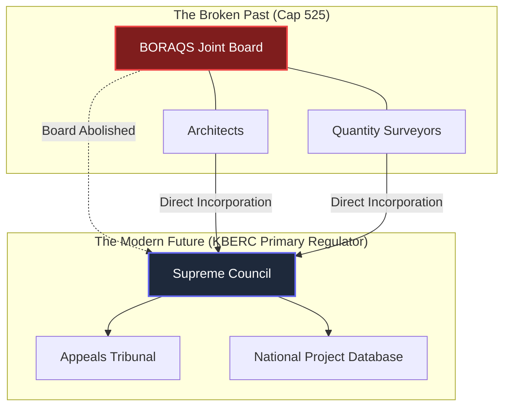

# The Architects Bill vs 2026 KBERC Draft

## 1. Deep Dive: The Hypocrisy of the Asymmetric Model

### The Architects' Desire for Divorce
The **Architects Bill** represents the ultimate desire of the Architectural Association of Kenya (AAK) for absolute independence. After 90 years of sharing a joint board with Quantity Surveyors under the archaic Cap 525, Architects sought to create a standalone regulatory body—a Board exclusively for Architects, by Architects. 

The primary argument for the Architects Bill was specialization. Architecture had evolved heavily into specialized branches (Landscape, Interior, Urban Design), and practitioners argued that a dedicated, purely architectural board was necessary to accredit these specialized degrees without interference from Quantity Surveyors.

### The Political Contradiction (The Hybrid Crisis)
The **2026 KBERC Draft** completely rejects the Architects Bill. KBERC’s mandate is to abolish standalone boards and unify all disciplines under a single, multi-disciplinary Council.

However, the State's adoption of the **"Asymmetric Hybrid Model"** for KBERC creates a massive political contradiction. Under this model, the State legally permits the Engineers to keep their standalone board (EBK under Cap 530), arguing that EBK is a high-functioning "plug-in" to KBERC. 

Architects have expressed significant concerns regarding this structural difference. Their primary policy question is: *"If the Engineers are permitted to maintain a standalone board and operate autonomously under the KBERC umbrella, why is the standalone Architects Bill being integrated? Why is KBERC mandating direct incorporation for us, while allowing Engineers to operate in a federated structure?"*

### 2026 Motivation (The State's Response)
The State’s justification for this hypocrisy is brutal but pragmatic: **Cap 525 failed, Cap 530 works.** 
The State's position is that the Engineers Board of Kenya has successfully maintained globally recognized standards, which supports its transition to a federated sub-agency. Conversely, the State argues that the framework under Cap 525 has faced systemic challenges in addressing building collapses, integrating allied professions, and modernizing its approach. Due to these systemic limitations in the architectural regulatory framework, the State determined that direct incorporation and management by KBERC as the "Primary Regulator" is necessary to restore public confidence.

---

## 2. Exhaustive Pros & Cons

### The Standalone Architects Bill
**Advantages:**
- **Pure Architectural Focus:** Allows the board to laser-focus on advancing architectural design, urban planning, and aesthetics without getting bogged down in QS cost disputes or engineering math.
- **Peer-to-Peer Discipline:** Architects are judged solely by veteran architects, ensuring disciplinary panels actually understand the artistic and spatial nuances of the profession.
- **Accreditation Speed:** A dedicated board could theoretically approve new, modern architectural degree programs much faster than a bloated, multi-disciplinary joint board.

**Disadvantages:**
- **The Ultimate Silo:** Creates yet another standalone regulatory island in the built environment, making it harder to coordinate liability with Engineers and QS when a building collapses.
- **Regulatory Bloat:** Creating a brand new parastatal exclusively for architects adds another layer of bureaucracy and taxpayer expense to the government.

### 2026 KBERC Draft (Direct Incorporation)
**Advantages:**
- **Forced Collaboration:** By denying Architects their standalone board, KBERC legally forces them to sit at the same table as QS and Interior Designers, ensuring designs are physically viable and cost-controlled from Day 1.
- **A Clean Slate:** Completely wipes out the legacy inefficiencies of BORAQS, replacing it with a modernized, digitally-driven Primary Regulator.

**Disadvantages:**
- **Loss of Autonomy:** Architects go from having 50% voting power on BORAQS (and 100% on the proposed Architects Bill) to holding only a minority fraction of seats on the KBERC Council.
- **Structural Transition Friction:** Mandating direct incorporation for Architects while granting a federated structure to Engineers has created professional apprehension, which requires careful change management to prevent friction within the KBERC Council.

---

## 3. Deep Clause Breakdown

### Part I: Definitions & Scope
- **Architects Bill:** Obsessively protects the title of "Architect." Focuses heavily on the exclusive right to submit drawings for county approval.
- **2026 Draft:** Removes the Architect's monopoly on county approvals. Under KBERC's National Project Database, the drawing is not considered "approved" until the Architect, QS, and Engineer have *all* digitally sealed it, reflecting KBERC's multi-disciplinary mandate.

### Part II: Administration & Board Composition
- **Architects Bill:** The Board is completely dominated by AAK nominees and university architecture deans. Total industry capture.
- **2026 Draft:** The KBERC Council drastically dilutes architectural power. Because KBERC is the direct regulator, Architects must share the Council evenly with QS, State Appointees, and consumer representatives.

### Part III: Education & Accreditation (The Real Loss)
- **Architects Bill:** The Board wields supreme power to accredit architecture schools and set the syllabus.
- **2026 Draft:** Because KBERC rejected the Architects Bill, Architects lose this supreme power. While KBERC creates an Architectural Technical Committee to advise on curriculum, the final statutory hammer belongs to the multi-disciplinary KBERC Council, meaning non-architects have a vote on architectural education.

### Part IV: Financial Liability & Discipline
- **Architects Bill:** Relies heavily on striking architects off the register for misconduct.
- **2026 Draft:** Bypasses internal peer review entirely for severe cases. If an architect is accused of negligence, they appear before the **Built Environment Appeals Tribunal**, a neutral judicial body that handles multi-disciplinary disputes, replacing the insular professional review system with independent oversight.

---

## 4. Visualizing the Architecture: Direct Incorporation

---
## Published Citations & References

[^1]: *The Architects Bill, 2022* (Proposed). Drafted to officially split the joint BORAQS board and grant architects total independence.
[^2]: Memoranda from the Architectural Association of Kenya (AAK) demanding parity with the Engineers Board of Kenya (EBK) regarding regulatory autonomy.
[^3]: Government of Kenya Policy Papers on Built Environment Reform, arguing that Cap 525's structural limitations necessitate direct incorporation under KBERC.
