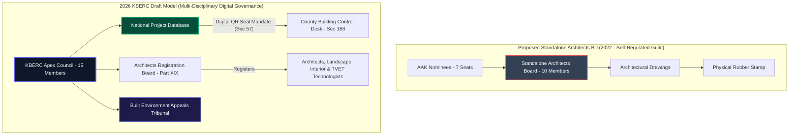

# The Architects Bill vs 2026 KBERC Draft: An Exhaustive Comparative Study

## 1. Deep Dive: The Hypocrisy & Political Economy of the Asymmetric Model

### 1.1 The Architectural Quest for Independence (2018–2023)
For decades, the **Architectural Association of Kenya (AAK)** expressed deep dissatisfaction with the legacy joint BORAQS framework (Cap 525), where Architects shared regulatory authority with Quantity Surveyors[^1]. Following the emergence of specialized design disciplines—such as Landscape Architecture, Interior Architecture, Urban Design, and Historic Conservation—the AAK spearheaded a major legislative initiative to enact **The Architects Bill (2022 Draft)**[^2].

The core objective of the Architects Bill was absolute professional autonomy: establishing a dedicated, standalone **Board of Registration of Architects** exclusively governed by architects, for architects. Practitioners argued that architectural design encompasses aesthetic, spatial, cultural, and environmental dimensions that cannot be properly evaluated or regulated by non-design disciplines.

### 1.2 The Asymmetric Hybrid Contradiction & The "Cap 525 vs Cap 530" Doctrine
The **2026 KBERC Draft** rejected the proposed standalone Architects Bill. Instead of granting architects an independent board, KBERC abolished BORAQS and mandated the direct incorporation of Architects under KBERC as their "Primary Regulator."

However, KBERC adopted an **"Asymmetric Hybrid Model"** that created intense political friction:
- **Engineers (Cap 530)** were permitted to retain their autonomous **Engineers Board of Kenya (EBK)** as a federated "plug-in" agency to KBERC.
- **Architects (and Quantity Surveyors)** were denied an autonomous board and forced into direct incorporation under KBERC's central Apex Council.

The Architectural Association of Kenya (AAK) raised fierce policy challenges against this structural dichotomy:
> *"If the State recognizes that Engineers possess specialized technical competencies requiring an autonomous statutory board (EBK Cap 530), why are Architects denied the same statutory dignity? Why must Architects submit to direct Primary Regulation by a multi-disciplinary Council while Engineers enjoy federated autonomy?"*

The State's justification for this structural asymmetry was pragmatic but unyielding: **"The Cap 525 Failure vs Cap 530 Success Doctrine."**[^3] The Cabinet Secretary and Parliamentary Committees concluded that while EBK under Cap 530 had established a robust, globally recognized accreditation framework, the legacy BORAQS framework under Cap 525 had failed to curb building collapses, formalize TVET design cadres, or enforce mandatory digital seal verification. Consequently, the State determined that BORAQS must be dismantled entirely and replaced by KBERC's direct multi-disciplinary authority.

### 1.3 Direct Incorporation & The ARB Framework (Part XIX)
Under Part XIX of the 2026 KBERC Bill, BORAQS is officially repealed and replaced by the **Board of Registration of Architects (ARB)**. The ARB functions as a specialized technical board within KBERC, managing professional examinations and register maintenance, while ultimate statutory authority over university accreditation, digital practice seals, and fee tariffs rests with the multi-disciplinary KBERC Apex Council (Section 6).

---

## 2. Exhaustive Pros & Cons Comparison

### 2.1 Proposed Standalone Architects Bill (2022 Draft)
**Advantages:**
- **Pure Architectural Specialization:** Dedicated 100% of statutory resources to advancing architectural design standards, spatial planning, historic preservation, and urban aesthetics.
- **Dedicated Accreditation:** A standalone board could rapidly accredit emerging specialized degree programs (e.g., Sustainable Architecture, Digital Computational Design, Landscape Urbanism).
- **Peer-to-Peer Judicial Discipline:** Misconduct allegations were judged exclusively by veteran architects who understood spatial design nuances and architectural contract administration.

**Disadvantages:**
- **Regulatory Isolation (Siloed Regulation):** Created a standalone regulatory island, exacerbating communication breakdowns between Architects, Structural Engineers, and Quantity Surveyors during project execution.
- **Risk of Industry Capture:** A board dominated by AAK nominees (7 out of 10 seats) presented a risk of self-protection when investigating peers accused of professional negligence or unapproved design variations.
- **Weak Deterrence:** Penalties for illegal practice were capped at standard civil fines (KES 1,000,000), providing inadequate financial deterrence against multi-million shilling commercial development fraud.

### 2.2 2026 KBERC Draft (Direct Incorporation & ARB Model)
**Advantages:**
- **Multi-Disciplinary Design Integration:** Legally forces Architects, Engineers, and Quantity Surveyors to collaborate under a single regulatory framework, ensuring designs are structurally sound and cost-engineered from inception.
- **Devastating Penalties:** Introduces fines up to **KES 50,000,000**, 5 years mandatory imprisonment (Section 151), and personal corporate director liability (Section 153) for gross design negligence or unlicenced practice.
- **Cryptographic Digital QR Seals:** Section 57 mandates Digital QR Seals tied to the National Project Database (NPD), eliminating downtown rubber stamp forgery and automating County approval desk verification (Section 188).
- **Mandatory PI Insurance:** Section 58 enforces KES 20M to KES 200M Professional Indemnity Insurance cover for all lead architectural consultants.

**Disadvantages:**
- **Loss of Standalone Autonomy:** Architects hold only a minority fraction of seats (2 out of 15) on the KBERC Apex Council, sharing governance with Engineers, QS, Planners, and State appointees.
- **Friction over Structural Asymmetry:** Ongoing resentment within the architectural profession regarding the federated autonomy granted to EBK (Cap 530 Engineers) versus the direct incorporation of ARB under KBERC.

---

## 3. Comprehensive Clause-by-Clause Statutory Breakdown

| Subject Area | Proposed Standalone Architects Bill (2022) | 2026 KBERC Draft (ARB Model) | Legal Impact & Policy Objective |
| :--- | :--- | :--- | :--- |
| **Governing Authority** | Sections 4 & 5: Standalone Architects Board (10 members, 7 AAK nominees, self-regulation)[^1]. | Section 6 & Part XIX: KBERC Apex Council + Board of Registration of Architects (ARB) under Part XIX. | Eliminates guild self-regulation; balances architectural oversight with multi-disciplinary public safety governance. |
| **Scope of Reserved Work** | Section 14: Exclusive right for Architects to submit architectural plans for County approval. | Section 43 & Schedule 2: Reserved Work for Architects, Landscape Architects, Interior Architects, and TVET Technologists. | Formalizes specialized architectural sub-disciplines and TVET diploma/degree design technologists. |
| **Plan Approval Mandate** | Single-discipline approval (Architect stamp alone accepted by local authorities). | Section 57 & 188: Multi-Disciplinary Digital QR Seal mandate (Architect + Structural Eng + MEP Eng + QS). | Prevents unverified architectural drawings from receiving County building permits without engineering clearance. |
| **Accreditation Authority** | Section 20: Standalone Board holds supreme statutory power over university architectural accreditation. | Section 35: KBERC Architectural Technical Committee advises, but Apex Council holds final statutory accreditation power. | Subject university accreditation to multi-disciplinary evaluation to ensure graduates possess structural and financial competence. |
| **Digital Verification** | Physical rubber stamps & embossed seals. | Section 57: Cryptographic Digital QR Seal linked to National Project Database (NPD). | Automates digital permit verification; completely eliminates downtown rubber stamp forgery. |
| **Maximum Fines** | Section 28: Max fine KES 1,000,000 for professional misconduct. | Section 150: Max fine KES 50,000,000 for gross structural/architectural negligence. | Increases financial penalties fifty-fold to align deterrence with modern commercial construction values. |
| **Custodial Penalties** | None. | Section 151: Custodial sentence up to 5 years for unauthorized practice or design fraud. | Criminalizes unlicenced practice, seal lending, and illegal architectural plan submissions. |
| **Financial Recourse** | None. | Section 58: Mandatory PII Cover (KES 20M to KES 200M based on project Risk Tier). | Protects building owners and taxpayers against financial loss resulting from architectural design errors. |
| **Dispute Resolution** | Internal Board Disciplinary Committee. | Section 141: Built Environment Appeals Tribunal (BEAT) (60-day expedited judicial review). | Provides neutral, swift judicial arbitration for architectural design and contractual disputes. |

---

## 4. Visualizing Architectural Governance: Standalone Bill vs KBERC

---

## Published Citations & Primary Legal References

[^1]: *The Architects Bill, 2022* (Proposed Draft). National Assembly of Kenya Bill No. YY of 2022. Government Printer, Nairobi.
[^2]: Architectural Association of Kenya (AAK) Memorandum (2022): *Position Paper on the Proposed Legislative Framework for the Regulation of Architectural Practice in Kenya*. AAK Secretariat, Professional Centre, Nairobi.
[^3]: Government of Kenya Ministry of Lands, Public Works, Housing and Urban Development: *Policy Framework on Built Environment Regulatory Reforms and Council Establishment*. Government Printer, Nairobi.
[^4]: *The Architects and Quantity Surveyors Act (Cap. 525)*, Laws of Kenya. Repealed under KBERC Part XIX.
[^5]: National Construction Authority (NCA): *Audit of Building Approvals and Structural Integrity Compliance in Urban Counties (2021)*.
[^6]: KBERC Bill 2026: *Section 57 (Digital QR Seals), Section 58 (PII Mandate), Section 141 (BEAT Tribunal), Section 188 (County Desks), Part XIX (ARB Establishment)*.
