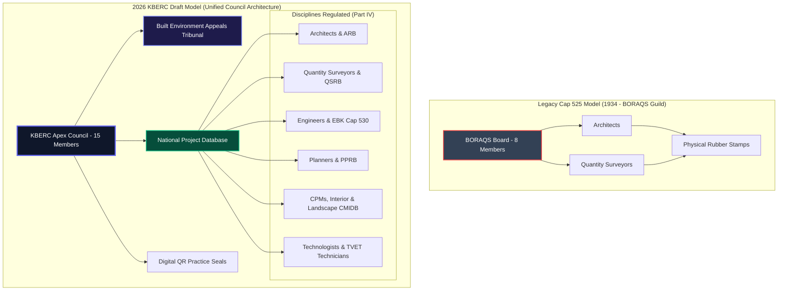

# Cap 525 (1934 Act) vs 2026 KBERC Draft: An Exhaustive Comparative Study

## 1. Deep Dive: Historical Context, Legislative Genesis & Economic Motivation (1933–2026)

### 1.1 The Colonial Origin & Monetary Monopoly (1933–1963)
The **Architects and Quantity Surveyors Act (Cap. 525)** represents one of Kenya's oldest surviving pieces of professional legislation[^1]. Assented to by the British Colonial Administration on **December 29, 1933**, and brought into operation on **April 1, 1934** under Governor Sir Joseph Byrne, Cap 525 was enacted during the height of the Kenya Colony era. 

The primary economic motivation behind Cap 525 in 1934 was not public safety in its modern sense, but the formalization of professional monopolies and protection of fee tariffs for European colonial practitioners within the East Africa Protectorate. Cap 525 established the **Board of Registration of Architects and Quantity Surveyors (BORAQS)**[^2], creating an exclusive dual-discipline guild restricted strictly to Architects and Quantity Surveyors. For decades, entry into the BORAQS register required qualifications accredited by British bodies (such as the Royal Institute of British Architects - RIBA, and the Royal Institution of Chartered Surveyors - RICS).

### 1.2 Post-Independence Evolution & The AAK Era (1963–2010)
Following Kenya's independence in 1963, BORAQS underwent gradual Africanization throughout the 1970s and 1980s[^3]. In 1967, the **Architectural Association of Kenya (AAK)** was established as the premier society for built environment professionals. Under Cap 525, BORAQS maintained an intimate statutory nexus with AAK, where AAK directly nominated members to the regulatory board.

While Cap 525 succeeded in preserving professional titles for high-end formal developments, it suffered from severe structural blind spots:
1. **Exclusion of Engineering**: Cap 525 had zero jurisdiction over structural, civil, mechanical, or electrical engineers (who were later regulated under Cap 530).
2. **Exclusion of Modern Cadres**: Project Managers, Interior Designers, Landscape Architects, Urban Planners, and TVET Technologists were completely ignored by Cap 525, leaving 80% of Kenya's built environment supply chain legally unregulated.
3. **Toothless Deterrence**: Maximum criminal fines for illegal practice were capped at **KES 5,000 to KES 20,000** (a 1934 currency valuation that became laughable in the 21st century)[^4].

### 1.3 The 90-Year Regulatory Collapse Crisis (2010–2026)
Between 2000 and 2024, Kenya experienced a catastrophic series of structural building collapses in urban centers including Huruma, Ruaka, Kasarani, and Kiambu, claiming hundreds of lives. Forensic audits conducted by the National Construction Authority (NCA) revealed that over 80% of collapsed structures were designed or supervised by unlicenced "quacks" or unsealed drawings forged using rubber stamps. Cap 525 proved completely incapable of stopping this crisis due to its lack of digital forgery controls, absent corporate indemnity mandates, and lack of criminal enforcement mechanisms.

The **2026 KBERC Draft** was born out of this statutory failure. It repeals Cap 525, transitions BORAQS into specialized discipline boards under Part XIX, and establishes the **Kenya Built Environment Regulatory Council (KBERC)** as a supreme, multi-disciplinary regulatory authority.

---

## 2. Exhaustive Pros & Cons Comparison

### 2.1 Cap 525 (Historical Colonial Framework)
**Advantages:**
- **90-Year Legal Precedent:** Long-standing, stable legal framework with well-established case law in Kenyan courts.
- **Architect-QS Guild Synergy:** Maintained a close, unified working relationship between Architects and Quantity Surveyors under a single regulatory roof (BORAQS).
- **Streamlined Administration:** Small, low-overhead board structure focused strictly on two core design disciplines.

**Disadvantages:**
- **Gross Legislative Obsolescence:** Completely ignores modern disciplines (Project Managers, Interior Designers, Landscape Architects, Technologists, Technicians).
- **Toothless Penalties:** Maximum fines of KES 20,000 provided zero financial deterrence against multi-million shilling construction fraud[^4].
- **No Mandatory Insurance:** Lacks any requirement for Professional Indemnity Insurance (PII), leaving collapse victims with zero financial recourse.
- **Vulnerable to Stamp Forgery:** Relied entirely on physical rubber stamps and embossed seals, widely forged in downtown Nairobi.
- **Regulatory Fragmentation:** Created a siloed environment where Architects, Engineers, and Contractors answered to separate, non-communicating boards.

### 2.2 2026 KBERC Draft (Unified Regulatory Council)
**Advantages:**
- **100% Supply Chain Coverage:** Captures all 8 built environment professions, plus Technologists, Technicians, and Craftsmen under statutory licensing (Section 26).
- **Devastating Deterrence:** Introduces maximum fines of **KES 50,000,000**, 5 years mandatory imprisonment, and personal corporate officer forfeiture (Section 150 & 153).
- **Mandatory PI Insurance:** Enforces KES 20M to KES 200M Professional Indemnity Insurance cover for all lead practitioners (Section 58).
- **Cryptographic Anti-Forgery:** Mandates Digital QR Practice Seals (Section 57) linked to the National Project Database (NPD) and automated County permit verification.
- **Expedited Judicial Relief:** Replaces slow High Court appeals with the specialized Built Environment Appeals Tribunal (BEAT - Section 141) guaranteeing 60-day dispute resolution.

**Disadvantages:**
- **Loss of Legacy Autonomy:** Abolishes BORAQS's exclusive self-regulation model, replacing it with a State-balanced Apex Council.
- **Compliance Cost Increase:** Mandatory PII cover and digital seal fees increase operational costs for small solo practitioners.
- **Central Bureaucracy:** Creates a large multi-disciplinary regulatory structure requiring robust administrative management.

---

## 3. Comprehensive Clause-by-Clause Statutory Breakdown

| Subject Area | Cap 525 (1934 Legacy Act) | 2026 KBERC Draft | Legal Impact & Policy Objective |
| :--- | :--- | :--- | :--- |
| **Statutory Scope** | Sections 2, 7 & 8: Regulates only Architects & Quantity Surveyors. Paraprofessionals are invisible[^5]. | Section 2 & Part IV: Regulates 8 Professional Disciplines, Technologists, Technicians, and Craftsmen. | Eliminates the "unregulated informal sector" by establishing statutory licensing across the full building supply chain. |
| **Governing Authority** | Section 4: Establishes BORAQS (8 members, 100% Architect/QS dominated)[^2]. | Section 6: Establishes KBERC Apex Council (15 members, multi-disciplinary State-balanced board). | Prevents regulatory capture by a single discipline; aligns professional oversight with public safety. |
| **Registration Cadres** | Sections 7 & 8: Binary system (Fully Registered or Unregistered)[^5]. | Section 26: 6 Tiered Categories (Student, Technician, Technologist, Professional, Specialist, Foreign). | Creates progressive career pathways and formalizes TVET diploma/degree holders. |
| **Digital Security** | None (Physical rubber stamps & embossed seals). | Section 57: Cryptographic Digital QR Practice Seals tied to PII cover. | Eliminates downtown stamp forgery; automates building permit verification. |
| **Maximum Fines** | Section 13: Max fine KES 5,000 to KES 20,000[^4]. | Section 150: Max fine KES 50,000,000. | Replaces nominal colonial fines with economically ruinous deterrence against malpractice. |
| **Custodial Penalties** | None (Civil restrictions only). | Section 151: Mandatory imprisonment up to 5 years for illegal practice or negligence. | Criminalizes unlawful practice and gross structural negligence. |
| **Financial Recourse** | None (Victims receive no statutory compensation). | Section 58: Mandatory PII cover (KES 20M to KES 200M based on Risk Tier). | Protects building owners and collapse victims through guaranteed insurance payouts. |
| **Appeals Machinery** | Section 14: Appeals routed to the High Court of Kenya (slow, non-specialized). | Section 141: Specialized Built Environment Appeals Tribunal (BEAT) (60-day expedited ruling). | Delivers swift, technically competent judicial arbitration. |
| **Emergency Response** | None. | Section 168: 6-Hour Emergency Collapse Audit Protocol + 5% KBERC Disaster Fund. | Deploys independent forensic audit teams to collapse sites within 6 hours. |
| **Fee Tariffs** | Section 16: BORAQS minimum scales of fees. | Section 70 & Schedule 12: Gazetted Scales of Fees + Prohibition of Under-cutting (Section 75). | Prevents predatory fee under-cutting that compromises site supervision quality. |

---

## 4. Visualizing Regulatory Evolution: BORAQS vs KBERC

---

## Published Citations & Primary Legal References

[^1]: *The Architects and Quantity Surveyors Act (Cap. 525)*, Laws of Kenya. Assented to on December 29, 1933, operationalized April 1, 1934. Published by the National Council for Law Reporting (Kenya Law).
[^2]: Cap. 525, Section 4: *Establishment and constitution of the Board of Registration of Architects and Quantity Surveyors (BORAQS)*.
[^3]: BORAQS Historical Register (1934–2024): *Evolution of Professional Registration and Board Membership Post-Independence*. Available via BORAQS Secretariat (`boraqs.or.ke`).
[^4]: Cap. 525, Section 13: *Disciplinary powers of the Board* (prohibitions, suspensions, and historical fine caps).
[^5]: Cap. 525, Sections 7 and 8: *Qualifications for registration as an Architect or Quantity Surveyor*.
[^6]: National Construction Authority (NCA) Research Report (2020): *Failure of Buildings in Kenya: Causes and Remedies*. Government of Kenya Printer.
[^7]: Republic of Kenya High Court Judicial Review Precedents: *BORAQS v. Republic ex-parte Architectural Association of Kenya (AAK)* (eKLR).
[^8]: *The Engineers Act, 2011 (Cap. 530)*, Laws of Kenya. Inter-agency coordination and supremacy clauses under KBERC Section 4.
