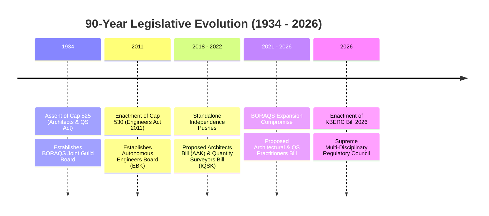
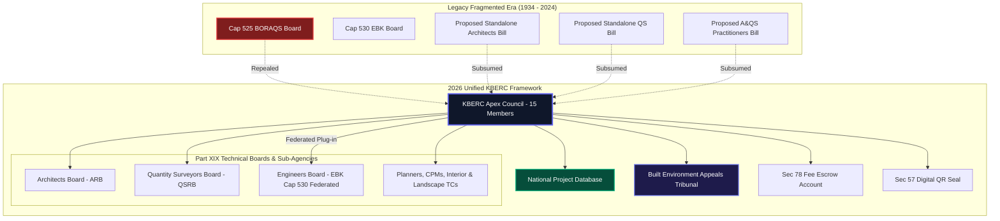

# Master Legislative Lineage & Full Summary Comparison

## 1. Deep Dive: The 90-Year Legislative Evolution & Multi-Bill Synthesis (1934–2026)

### 1.1 The Timeline of Kenyan Built Environment Legislation
Over a period spanning more than nine decades (1934 to 2026), Kenya's regulatory landscape for the built environment evolved from colonial-era discipline protectionism into a modern, multi-disciplinary governance framework[^1].

### 1.2 Why Piecemeal Standalone Bills Failed
Between 2018 and 2024, professional associations pushed for separate standalone bills (the Architects Bill, the Quantity Surveyors Bill, and the expanded Practitioners Bill)[^2][^3]. However, the State, National Assembly, and Cabinet Secretary concluded that proliferating standalone parastatals created severe structural vulnerabilities:
1. **Regulatory Silos & Collapse Traps**: Separating Architects, Engineers, and QS into autonomous boards meant no single body had jurisdiction to investigate multi-disciplinary failures when buildings collapsed.
2. **Exclusion of Informal Cadres**: Standalone bills focused exclusively on university degree-holders, leaving TVET diploma technologists, technicians, and site supervisors completely unregulated.
3. **Toothless Penalties & Stamp Forgery**: Legacy fine caps (KES 20,000 under Cap 525) and physical rubber stamps permitted downtown forgery networks to push unverified drawings through County approvals.

### 1.3 The Asymmetric Hybrid Solution
The **2026 KBERC Bill** solves these structural failures through an **Asymmetric Hybrid Mandate**:
- **Primary Regulator for Design & Cost Disciplines**: Repeals Cap 525 and directly regulates Architects (ARB), Quantity Surveyors (QSRB), Interior Designers, Landscape Architects, Urban Planners, and Construction Managers under Part XIX.
- **Secondary Coordinator for Engineers (Cap 530)**: Preserves the autonomous **Engineers Board of Kenya (EBK)** under Cap 530 for internal university accreditation and engineering exams, while statutorily requiring Engineers to "plug into" KBERC's central **National Project Database (NPD)**, **Digital QR Seals (Section 57)**, and the **Built Environment Appeals Tribunal (BEAT - Section 141)**.

---

## 2. Master 5-Way Legislative Comparison Matrix

| Regulatory Parameter | Cap 525 (1934 Legacy Act) | Proposed QS Bill (2022) | Proposed Architects Bill (2022) | Proposed A&QS Practitioners Bill (2026) | Engineers Act (Cap 530 - 2011) | 2026 KBERC Draft (Unified Council) |
| :--- | :--- | :--- | :--- | :--- | :--- | :--- |
| **Primary Statutory Authority** | BORAQS Joint Board (8 members)[^1] | Standalone QS Board (10 members)[^2] | Standalone Architects Board (10 members)[^3] | Expanded BORAQS Board (14 members)[^4] | Engineers Board of Kenya (EBK - 13 members)[^5] | **KBERC Apex Council (15 members)** |
| **Scope of Regulated Cadres** | Architects & QS only | Quantity Surveyors only | Architects only | Arch, QS, Interior, Landscape, CPM | Engineers & Engineering Technologists | **8 Professions + TVET Technologists & Technicians** |
| **Governance Model** | Architect/QS Guild Self-Regulation | IQSK Nominee Self-Regulation | AAK Nominee Self-Regulation | Architect/QS Hegemony over Allied Cadres | Autonomous Technical Board | **Neutral Multi-Disciplinary State-Balanced Council** |
| **TVET & Technician Integration** | Legally Invisible | Excluded | Excluded | Restricted Recognition | Separate EBK Register | **6 Tiered Categories (Section 26)** |
| **Plan Approval Security** | Physical Rubber Stamps | Physical Rubber Stamps | Physical Rubber Stamps | Physical Rubber Stamps | Physical Rubber Stamps | **Cryptographic Digital QR Seal (Section 57)** |
| **County Permitting** | Single Stamp Accepted | Single BQ Accepted | Single Plan Accepted | Single Plan Accepted | Single Drawing Accepted | **Multi-Disciplinary NPD Certificate (Section 188)** |
| **Maximum Fines** | KES 20,000[^1] | KES 1,000,000 | KES 1,000,000 | KES 1,000,000 | KES 5,000,000 | **KES 50,000,000 (Section 150)** |
| **Custodial Penalties** | None | None | None | None | Up to 2 Years | **Up to 5 Years Mandatory Imprisonment (Section 151)** |
| **Financial Recourse** | None | None | None | None | None | **Mandatory PII Cover KES 20M–200M (Section 58)** |
| **Fee Security** | BORAQS Scale | IQSK Scale | AAK Scale | BORAQS Scale | EBK Tariff | **Gazetted Tariffs + Section 78 Fee Escrow Account** |
| **Dispute Resolution** | High Court Appeals | Internal Board Panel | Internal Board Panel | High Court Appeals | High Court Appeals | **Built Environment Appeals Tribunal (BEAT - Sec 141)** |

---

## 3. Master Synthesis of Pros & Cons Across All Legislative Models

### 3.1 Fragmented Legacy Frameworks (Cap 525, Standalone Bills, Practitioners Bill)
**Strengths:**
- High discipline specialization for individual professions.
- Intimate guild representation via professional societies (AAK, IQSK, IEK).

**Fatal Weaknesses:**
- Created regulatory islands where Architects, Engineers, and QS operated without cross-disciplinary accountability.
- Allowed 80% of Kenya's building supply chain (informal site supervisors and technicians) to remain legally unregulated.
- Provided nominal fine caps (KES 20,000) that failed to deter multi-million shilling building fraud and structural negligence.

### 3.2 2026 KBERC Draft (Unified Apex Council Model)
**Strengths:**
- **100% Supply Chain Accountability**: Regulates all 8 professions plus TVET diploma holders under progressive licensing.
- **Devastating Financial & Criminal Deterrence**: Max fines of KES 50,000,000, 5 years imprisonment, and personal director forfeiture (Section 153).
- **Public Protection & Financial Indemnity**: Mandatory PII cover (Section 58) guarantees victim compensation; Section 78 Escrow secures consultant fees.
- **Automated Anti-Forgery**: Cryptographic Digital QR Seals tied to National Project Database (NPD) prevent unverified plans from receiving County building permits.
- **Expedited Judicial Relief**: Specialized Built Environment Appeals Tribunal (BEAT) delivers technically competent 60-day dispute rulings.

**Weaknesses:**
- High administrative responsibility requiring efficient Council management.
- Requires ongoing change management to maintain smooth coordination between KBERC and EBK Cap 530.

---

## 4. Master Visualizing Diagram: The Evolution to KBERC

---

## Published Citations & Primary Legal References

[^1]: *The Architects and Quantity Surveyors Act (Cap. 525)*, Laws of Kenya. Assented Dec 29, 1933; operationalized April 1, 1934. Published by National Council for Law Reporting (Kenya Law).
[^2]: *The Quantity Surveyors Bill, 2022* (Proposed Draft). National Assembly Bill No. XX of 2022. Government Printer, Nairobi.
[^3]: *The Architects Bill, 2022* (Proposed Draft). National Assembly Bill No. YY of 2022. Government Printer, Nairobi.
[^4]: *The Architectural and Quantity Surveying Practitioners Bill, 2026* (Proposed Draft). National Assembly Bill No. ZZ of 2026 (`parliament.go.ke`).
[^5]: *The Engineers Act, 2011 (Cap. 530)*, Laws of Kenya. Assented Jan 27, 2012. Preserved under KBERC Asymmetric Hybrid Model.
[^6]: KBERC Bill 2026: *Section 6 (Apex Council), Section 26 (Tiered Registration), Section 57 (Digital QR Seals), Section 58 (PII Mandate), Section 78 (Fee Escrow), Section 141 (BEAT Tribunal), Section 150/151 (Penalties), Section 188 (County Desks), Part XIX (Transitional Provisions)*.
