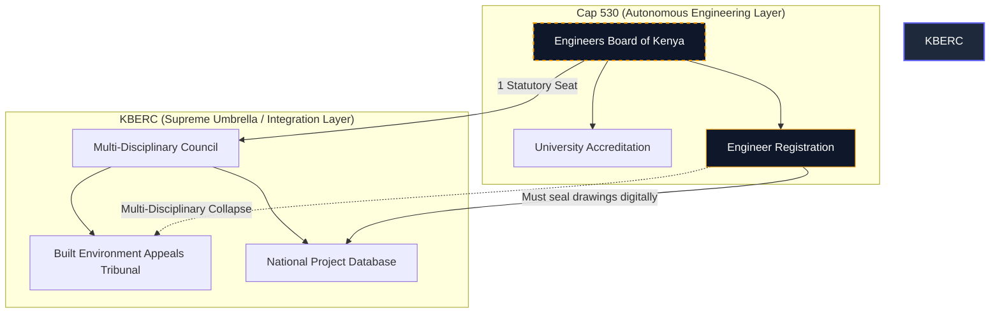

# The Engineers Act (Cap 530) vs 2026 KBERC Draft

## 1. Deep Dive: The Initial Consolidation Strategy & The Asymmetric Pivot

### The Autonomy of the Engineers Board of Kenya (EBK)
To understand the current regulatory landscape in Kenya, one must acknowledge the sheer power of the **Engineers Act, 2011 (Cap 530)**. Unlike the dangerously obsolete Cap 525 governing Architects, Cap 530 established the **Engineers Board of Kenya (EBK)** as an uncompromising fortress of technical regulation. EBK wields statutory power to ban universities lacking proper equipment and enforces the Washington Accord standards. Because structural engineering is fundamentally an issue of life and death, EBK operates with terrifying autonomy.

### The Initial Centralization Challenges
Early drafts of KBERC proposed a highly centralized model: **The Direct Incorporation Model**. The idea was to transition EBK and place Engineers onto a centralized board alongside Architects and Interior Designers. The engineering profession expressed strong reservations, arguing that requiring the board responsible for load-bearing capacities to share voting power with non-engineers could inadvertently impact structural safety standards. Replacing Cap 530 abruptly was deemed too disruptive to the industry.

### The Legislative Masterpiece: The "Asymmetric Hybrid Model"
The strategic refinement in the 2026 KBERC Draft is pivoting from direct incorporation to an **Asymmetric Hybrid Model**. 

Under this model, KBERC has a "Dual Mandate." For Architects and QS (whose legacy board, BORAQS, is transitioned), KBERC is their *Primary Regulator*, handling their daily exams and registration. However, for Engineers, KBERC acts as a *Secondary Coordinator*. Cap 530 remains intact. EBK continues to accredit universities and manage internal exams. However, EBK is statutorily required to "plug into" the KBERC ecosystem for cross-disciplinary collaboration and national permitting.

---

## 2. Exhaustive Pros & Cons

### The Engineers Act, 2011 (Cap 530) - Standalone
**Advantages:**
- **Uncompromising Safety Standard:** Pure technical standards remain exceptionally high, insulated from the "softer" design disciplines.
- **Accreditation Power:** Gives EBK absolute power to strong-arm universities.
- **Clear Liability:** Makes it very clear who is legally responsible for structural integrity.

**Disadvantages:**
- **The Silo Effect:** EBK cannot regulate outside its borders. If an Architect forces an Engineer into a compromised design, EBK has no jurisdiction to punish the Architect.
- **Fragmented Approvals:** Engineering approvals happen in a vacuum, separated from the architectural approvals, creating loopholes for "quacks".

### 2026 KBERC Draft - Asymmetric Hybrid Model
**Advantages:**
- **Preserved Engineering Autonomy:** Engineers lose zero internal technical autonomy. EBK remains the gold standard for engineering curriculum.
- **Systemic Accountability:** If a building collapses due to multi-disciplinary failure, KBERC pulls the Architect (who they regulate directly) and the Engineer (who they pull from EBK's jurisdiction for this specific disaster) into one unified tribunal.
- **Future-Proofed:** Relies on digital control of county permits rather than fighting over board seats.

**Disadvantages:**
- **Legislative Complexity:** Running an asymmetric model requires incredibly careful, complex legal drafting (Supremacy Clauses) to prevent jurisdictional overlap and constitutional challenges.
- **Double Taxation Fears:** Engineers may fear they have to pay licensing fees to both EBK and KBERC.

---

## 3. Deep Clause Breakdown: Future-Proofing the Architecture

### Part I: The "Supremacy Clause" (Future-Proofing EBK Amendments)
- **Cap 530:** Protects the title of "Engineer."
- **2026 Draft:** How do we prevent Engineers from amending Cap 530 in the future to escape KBERC? We use a **Supremacy Clause**. The KBERC Bill states: *"Notwithstanding the provisions of any other written law, where a conflict arises regarding multi-disciplinary project coordination, the provisions of this Act shall prevail."* Even if EBK tries to legislate a loophole in 2030, this clause ensures KBERC's integration rules legally override them.

### Part II: Administration (The Imbalanced Board)
- **Cap 530:** The EBK is a fortress of engineering power, nominated entirely by the industry. 
- **2026 Draft:** Because KBERC directly manages Architects/QS but only loosely coordinates Engineers, the voting power reflects this asymmetry. The Council is heavily populated by State Appointees, Architects, and QS. The Engineers Board of Kenya (EBK) is granted *one* ex-officio statutory seat (e.g., the EBK Chairman). This ensures EBK has a voice in multi-disciplinary rules without giving them control over the Architects' daily affairs.

### Part III: The "Delegation of Powers" Loophole
- **Cap 530:** EBK holds statutory power over engineering accreditation.
- **2026 Draft:** To avoid KBERC being struck down for discrimination (treating professions differently), the Bill claims supreme power over *all* built environment education. However, it uses a **Delegation Clause**: *"The Council may delegate its regulatory powers regarding a specific profession to an existing statutory board."* KBERC legally "delegates" engineering regulation back down to EBK, asserting KBERC's supremacy on paper while preserving EBK's total autonomy in reality.

### Part IV: The Joint Disciplinary Tribunal (The Accountability Plug-in)
- **Cap 530:** If an engineer makes a purely structural math error, EBK tries them internally. 
- **2026 Draft:** The KBERC Bill introduces the **Built Environment Appeals Tribunal**. If a building collapses and the fault is disputed between the Architect and the Engineer, jurisdiction *automatically transfers* up to the KBERC Tribunal. This prevents EBK and the Architects Board from running separate, conflicting investigations that allow guilty parties to escape.

### Part V: The Financial Gateway Lock (Controlling the Counties)
- **Cap 530:** Relies on physical stamps and EBK-specific registries.
- **2026 Draft:** The ultimate future-proofing relies on controlling the money and the permits. KBERC legally binds the **County Governments**, not the engineers. The clause states: *"No County Government shall issue a construction permit unless a multi-disciplinary compliance certificate has been generated by the KBERC National Project Database."* Engineers can change their internal laws all they want, but if the County physically cannot click "Approve" without KBERC's digital green light, engineers are forced to comply forever.

---

## 4. Visualizing the Architecture: The Federated Plug-in

---
## Published Citations & References

[^1]: *The Engineers Act, 2011 (Cap. 530)*, Laws of Kenya. Assented to on January 27, 2012. 
[^2]: Strategic legislative frameworks regarding Asymmetric Regulatory Models and Supremacy Clauses in built environment legislation.
[^3]: Cap. 530, Section 7: Safeguarded under the "Delegation of Powers" loophole in the KBERC Draft.
