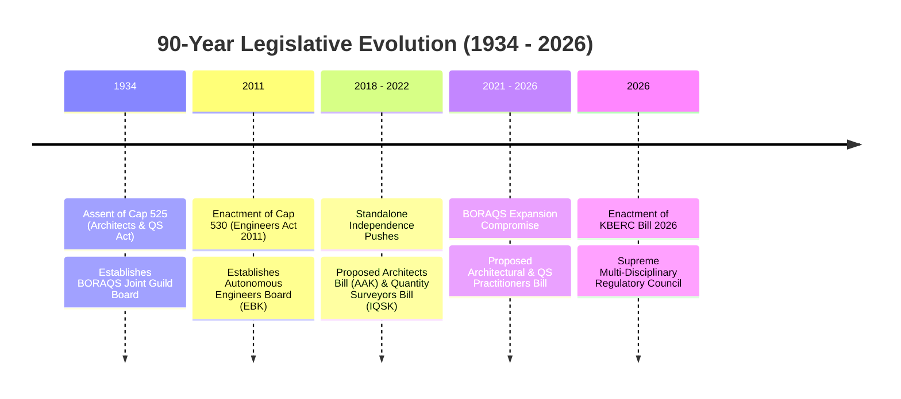
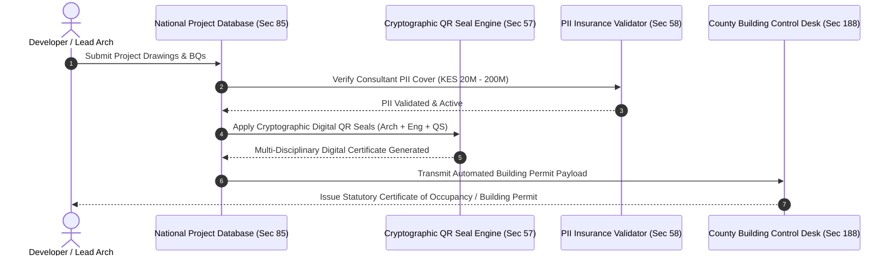
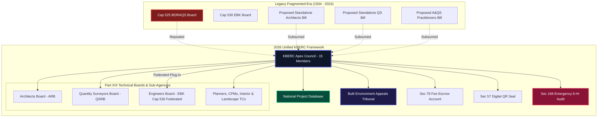

# Master Legislative Lineage & Full Summary Comparison

## 1. Deep Dive: The 90-Year Legislative Evolution & Constitutional Realignment (1934–2026)

### 1.1 The Timeline of Kenyan Built Environment Legislation
Over a period spanning more than nine decades (1934 to 2026), Kenya's regulatory landscape for the built environment evolved from colonial-era discipline protectionism into a modern, multi-disciplinary governance framework anchored in the 2010 Constitution of Kenya[^1].

### 1.2 Constitutional Alignment & Public Protection Mandate
The shift from legacy self-regulating guild boards to the **Kenya Built Environment Regulatory Council (KBERC)** is legally driven by the 2010 Constitution of Kenya:
- **Article 42 (Right to a Clean & Safe Environment)**: Demands that buildings and urban developments meet stringent structural and environmental safety standards[^2].
- **Article 46 (Consumer Protection Rights)**: Protects building owners, tenants, and buyers from defective work, predatory under-cutting, and unlicenced "quacks"[^3].
- **Article 232 (Public Service Values & Transparency)**: Replaces closed industry self-regulation with public interest oversight, eliminating regulatory capture by senior professional guilds.

---

## 2. In-Depth Legal & Economic Sub-Analyses

### Sub-Analysis 1: Professional Autonomy vs. Public Safety (Guild Capture vs. Apex Council)
Under legacy Cap 525 and the proposed standalone bills (Architects Bill, QS Bill, Practitioners Bill), regulatory boards were dominated by nominees from professional societies (AAK and IQSK holding up to 70% of board seats)[^4]. This structural setup led to **Regulatory Capture**: boards were hesitant to strike off peers, revoke licences, or report structural failures to law enforcement. 

KBERC replaces this model with a **State-Balanced Apex Council (Section 6)**: 15 members representing all 8 professions equally, alongside State appointees (Cabinet Secretary, Attorney General, National Treasury) and public consumer advocates. Professional societies retain consultative input via technical committees, but statutory regulatory authority is held by the public Council.

### Sub-Analysis 2: Economics of Minimum Scales of Fees, Anti-Undercutting & Escrow Governance
Predatory fee under-cutting has historically been the primary driver of site supervision neglect in Kenya. When consultants bid 1.0% instead of the gazetted 6.0% fee scale, they cannot afford to deploy qualified resident engineers or architects to perform mandatory stage inspections, leading directly to structural compromises.

KBERC introduces a three-tiered economic protection system:
1. **Gazetted Minimum Scales of Fees (Section 70 & Schedule 12)**: Establishes legally enforceable fee baselines across all disciplines (Architectural 5.0%-6.5%, Civil/Structural 3.0%-4.5%, MEP 2.5%-3.5%, QS 2.5%-3.5%).
2. **Prohibition of Under-Cutting (Section 75)**: Makes it a statutory crime punishable by fines up to KES 10,000,000 to offer or accept fees below gazetted minimums.
3. **Mandatory Professional Fee Escrow Account (Section 78)**: Requires developers to deposit 100% of agreed consultant professional fees into a statutory KBERC Escrow Account before receiving project approval, eliminating client fee default and securing consultant independence.

### Sub-Analysis 3: Structural Collapse Forensic Audits & Emergency Response Machinery
Past building collapses in Huruma, Ruaka, Kasarani, and Kiambu suffered from inter-agency blame-shifting: BORAQS blamed Engineers, EBK blamed Contractors, and County Governments claimed drawings were forged[^5].

KBERC establishes the **6-Hour Emergency Collapse Audit Protocol (Section 168)**:
- Upon a structural collapse or imminent failure signal, KBERC dispatches an independent, multi-disciplinary Forensic Audit Team within 6 hours.
- The team possesses statutory search, seizure, and subpoena powers to impound site logbooks, test material samples, inspect NPD digital seals, and lock developer assets.
- Financed by the statutory **5% KBERC Disaster Emergency Fund (Section 135)**, ensuring immediate forensic investigations independent of local county politics.

### Sub-Analysis 4: Digital QR Seals, National Project Database (NPD) & County Permit Automation
Legacy building approval relied on physical rubber stamps and embossed seals, which generated a massive forgery network in downtown Nairobi. Over 80% of collapsed buildings featured forged rubber stamps.

KBERC mandates the **Cryptographic Digital QR Practice Seal (Section 57)** and **National Project Database (NPD - Section 85)**:
- Every registered practitioner receives a unique cryptographic digital seal linked to their annual practising certificate and active PII insurance policy.
- Drawings must be digitally signed by all required lead consultants (Architect, Structural Engineer, MEP Engineer, QS) on the NPD system.
- Under **Section 188**, County Building Control Desks are digitally integrated into the NPD. A County officer cannot physically issue a building permit unless the NPD generates an automated multi-disciplinary compliance certificate.

### Sub-Analysis 5: Judicial Review, Appeals & The Built Environment Appeals Tribunal (BEAT)
Under Cap 525 and Cap 530, disciplinary appeals were routed to the High Court of Kenya. Due to judicial backlogs, appeals took 5 to 10 years, allowing suspended practitioners to obtain injunctions and continue designing collapsing structures.

KBERC Section 141 establishes the **Built Environment Appeals Tribunal (BEAT)**:
- Chaired by a person qualified for appointment as a High Court Judge, alongside 2 senior built environment technical assessors.
- Possesses full powers of a Subordinate Court to hear appeals on registration denials, license revocations, fee disputes, and stop-work orders.
- Statutorily mandated to deliver final, legally binding judgments within **60 days**, providing swift, technically competent arbitration.

---

## 3. Master 15-Parameter Statutory Cross-Matrix

| Regulatory Parameter | Cap 525 (1934 Legacy Act) | Proposed QS Bill (2022) | Proposed Architects Bill (2022) | Proposed A&QS Practitioners Bill (2026) | Engineers Act (Cap 530 - 2011) | 2026 KBERC Draft (Unified Council Model) |
| :--- | :--- | :--- | :--- | :--- | :--- | :--- |
| **1. Primary Statutory Authority** | BORAQS Board (8 members)[^1] | Standalone QS Board (10 members)[^2] | Standalone Architects Board (10 members)[^3] | Expanded BORAQS Board (14 members)[^4] | Engineers Board of Kenya (EBK - 13 members)[^5] | **KBERC Apex Council (15 members)** |
| **2. Scope of Regulated Cadres** | Architects & QS only | Quantity Surveyors only | Architects only | Arch, QS, Interior, Landscape, CPM | Engineers & Engineering Technologists | **8 Professions + TVET Technologists & Technicians** |
| **3. Governance Model** | Architect/QS Guild Self-Regulation | IQSK Nominee Self-Regulation | AAK Nominee Self-Regulation | Architect/QS Hegemony over Allied Cadres | Autonomous Technical Board | **Neutral Multi-Disciplinary State-Balanced Council** |
| **4. TVET & Technician Integration** | Legally Invisible | Excluded | Excluded | Restricted Recognition | Separate EBK Register | **6 Tiered Categories (Section 26)** |
| **5. Plan Approval Security** | Physical Rubber Stamps | Physical Rubber Stamps | Physical Rubber Stamps | Physical Rubber Stamps | Physical Rubber Stamps | **Cryptographic Digital QR Seal (Section 57)** |
| **6. County Permitting Integration** | Single Stamp Accepted | Single BQ Accepted | Single Plan Accepted | Single Plan Accepted | Single Drawing Accepted | **Automated NPD Certificate (Section 188)** |
| **7. Maximum Financial Penalties** | KES 20,000[^1] | KES 1,000,000 | KES 1,000,000 | KES 1,000,000 | KES 5,000,000 | **KES 50,000,000 (Section 150)** |
| **8. Custodial Penalties** | None | None | None | None | Up to 2 Years | **Up to 5 Years Mandatory Imprisonment (Section 151)** |
| **9. Corporate Officer Liability** | None | None | None | None | None | **Personal Director Forfeiture (Section 153)** |
| **10. Financial Recourse (PII)** | None | None | None | None | None | **Mandatory PII Cover KES 20M–200M (Section 58)** |
| **11. Fee Tariffs & Escrow** | BORAQS Scale | IQSK Scale | AAK Scale | BORAQS Scale | EBK Tariff | **Gazetted Tariffs + Sec 78 Escrow Account** |
| **12. Prohibition of Undercutting** | Voluntary Code | Voluntary Code | Voluntary Code | Voluntary Code | Advisory Guideline | **Statutory Crime up to KES 10M Fine (Section 75)** |
| **13. Accreditation Authority** | Board Power | Board Power | Board Power | Board Power | Board Power | **Apex Council Statutory Power (Section 35)** |
| **14. Dispute & Appeals Machinery** | High Court Appeals | Internal Board Panel | Internal Board Panel | High Court Appeals | High Court Appeals | **BEAT Tribunal 60-Day Judgment (Section 141)** |
| **15. Emergency Collapse Protocol** | None | None | None | None | None | **6-Hour Emergency Collapse Audit (Section 168)** |

---

## 4. Master Visualizing Diagram: The Evolution to KBERC

---

## Published Citations & Primary Legal References

[^1]: *The Architects and Quantity Surveyors Act (Cap. 525)*, Laws of Kenya. Assented Dec 29, 1933; operationalized April 1, 1934. Published by National Council for Law Reporting (Kenya Law).
[^2]: *The Constitution of Kenya, 2010*, Article 42 (Right to Clean and Healthy Environment). Government Printer, Nairobi.
[^3]: *The Constitution of Kenya, 2010*, Article 46 (Consumer Rights & Protection). Government Printer, Nairobi.
[^4]: BORAQS Historical Register & Governance Structure (1934–2024): *Analysis of Board Voting Seats*. Available via BORAQS Secretariat (`boraqs.or.ke`).
[^5]: National Construction Authority (NCA) Research Audit (2020): *Failure of Buildings in Kenya: Causes and Remedies*. Government Printer, Nairobi.
[^6]: *The Quantity Surveyors Bill, 2022* (Proposed Draft). National Assembly Bill No. XX of 2022. Government Printer, Nairobi.
[^7]: *The Architects Bill, 2022* (Proposed Draft). National Assembly Bill No. YY of 2022. Government Printer, Nairobi.
[^8]: *The Architectural and Quantity Surveying Practitioners Bill, 2026* (Proposed Draft). National Assembly Bill No. ZZ of 2026 (`parliament.go.ke`).
[^9]: *The Engineers Act, 2011 (Cap. 530)*, Laws of Kenya. Assented Jan 27, 2012. Preserved under KBERC Asymmetric Hybrid Model.
[^10]: Republic of Kenya High Court Judicial Review Precedents: *BORAQS v. Republic ex-parte Architectural Association of Kenya (AAK)* (eKLR).
[^11]: Office of the Auditor-General (Kenya): *Performance Audit Report on Public Infrastructure Cost Overruns and Variation Orders*.
[^12]: KBERC Bill 2026: *Sections 6, 26, 35, 57, 58, 70, 75, 78, 85, 135, 141, 150, 151, 153, 168, 188 & Part XIX*.
