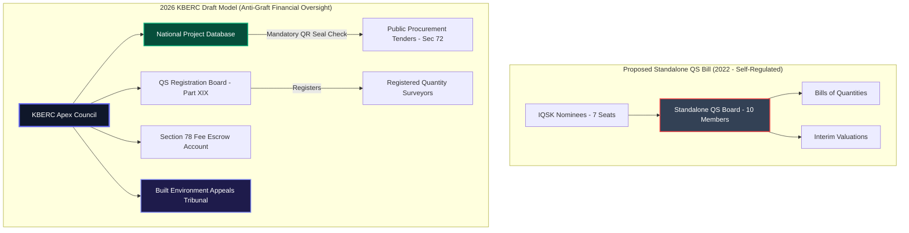

# The Quantity Surveyors Bill vs 2026 KBERC Draft: An Exhaustive Comparative Study

## 1. Deep Dive: Controlling the Money, Cost Engineering & The Anti-Graft Imperative

### 1.1 The QS Push for Statutory Independence (2019–2023)
Following decades of frustration under the legacy joint BORAQS framework (Cap 525), the **Institute of Quantity Surveyors of Kenya (IQSK)** spearheaded a major legislative campaign to establish a standalone regulatory board[^1]. The result of this push was **The Quantity Surveyors Bill (2022 Draft)**.

The core argument advanced by IQSK was fundamentally economic: Quantity Surveyors (QS) are the cost engineers and financial stewards of the built environment[^2]. They prepare statutory Bills of Quantities (BQs), measure physical works, manage contract valuations, issue interim certificates, and arbitrate financial disputes. IQSK argued that regulating cost engineering requires a specialized legal and mathematical skill set completely distinct from architectural aesthetic design, and therefore warranted an autonomous, standalone **Quantity Surveyors Board**.

### 1.2 The State's Anti-Corruption Rationale & The Asymmetric Hybrid Decision
The **2026 KBERC Draft** brutally rejected the proposed standalone Quantity Surveyors Bill. 

Under the State's **"Asymmetric Hybrid Model"**, while Engineers preserved their autonomous board under the **Engineers Act, 2011 (Cap 530)**, Quantity Surveyors (along with Architects) were directly incorporated under KBERC as their "Primary Regulator."

The Quantity Surveying profession raised fierce objections, pointing to what they viewed as political hypocrisy:
> *"If Engineers can operate as an autonomous 'plug-in' board (EBK Cap 530) to KBERC, why couldn't a standalone QS Board also plug in? Quantity Surveyors manage project budgets; we do not design structural frames. We deserve autonomous self-regulation."*

The State's refusal to grant QS autonomy stemmed from a critical national imperative: **Public Procurement Anti-Corruption Control**[^3]. Forensic financial audits of Kenyan public infrastructure projects revealed that inflated Bills of Quantities, unvetted variation orders, and rigged valuation certificates represented the single largest vector for public sector graft, costing taxpayers billions of shillings annually. The National Treasury and Cabinet Secretary concluded that the State could not permit Quantity Surveying to operate as an autonomous, self-regulating guild prone to industry capture.

### 1.3 Direct Incorporation & The QSRB Framework (Part XIX)
By incorporating Quantity Surveyors directly under KBERC, the State achieved two major policy objectives:
1. **Direct Oversight over Construction Costing**: State appointees and multi-disciplinary representatives on the KBERC Apex Council gain statutory authority to monitor fee scales, review valuation standards, and audit financial compliance.
2. **Unified Project Licensing**: Under Part XIX, KBERC establishes the **Quantity Surveyors Registration Board (QSRB)** to manage internal professional exams and technical standards, while subjecting all lead QS practitioners to KBERC's central **National Project Database (NPD)** and **Digital QR Seal** verification (Section 57).

---

## 2. Exhaustive Pros & Cons Comparison

### 2.1 Proposed Standalone Quantity Surveyors Bill (2022 Draft)
**Advantages:**
- **Cost Engineering Specialization:** Focused 100% of regulatory resources on construction economics, life-cycle costing, and contractual law without design interference.
- **Dynamic Material Cost Indices:** A dedicated QS board could publish real-time, legally binding national material cost indices to stabilize volatile market pricing.
- **Specialized Dispute Resolution:** Contractual claims and interim valuation disputes would be arbitrated exclusively by veteran QS professionals who understand complex conditions of contract (e.g. FIDIC, JCT).

**Disadvantages:**
- **Risk of Industry Capture:** An autonomous board dominated by IQSK nominees risks leniency when investigating peers accused of inflating government BQs or approving fraudulent variations.
- **Siloed Regulatory Communication:** Separating QS from Architects and Engineers creates administrative silos where design revisions and cost calculations occur without cross-disciplinary transparency.
- **Lack of Criminal Deterrence:** Fines for malpractice were capped at relatively standard civil levels (KES 1,000,000), providing insufficient deterrence against multi-million shilling public procurement graft.

### 2.2 2026 KBERC Draft (Direct Incorporation & QSRB Model)
**Advantages:**
- **Forced Financial Transparency:** Multi-disciplinary oversight on the Apex Council makes it virtually impossible for corrupt practices or bloated BQs to escape detection.
- **Devastating Penalties:** Introduces fines up to **KES 50,000,000**, 5 years mandatory imprisonment, and personal corporate officer forfeiture (Section 150 & 153) for valuation fraud.
- **Mandatory Fee Escrow:** Section 78 requires client professional fees to be deposited in a secure escrow account prior to project commencement, protecting QS from client non-payment.
- **Prohibition of Under-Cutting:** Section 75 forbids practitioners from bidding below gazetted minimum fee scales, protecting QS firms from predatory fee cutting that compromises site supervision quality.
- **Public Procurement Integration:** Section 72 mandates KBERC Digital QR Seals in all public tenders, ensuring only verified QS practitioners can submit BQs for public works.

**Disadvantages:**
- **Loss of Standalone Autonomy:** Quantity Surveyors lose their bid for an independent board, sharing governance on the Apex Council with Architects, Engineers, and State appointees.
- **Perceived Asymmetry:** Frustration remains within the profession over the different treatment accorded to EBK (Cap 530 Engineers) versus QSRB under KBERC.

---

## 3. Comprehensive Clause-by-Clause Statutory Breakdown

| Subject Area | Proposed Standalone QS Bill (2022) | 2026 KBERC Draft (QSRB Model) | Legal Impact & Policy Objective |
| :--- | :--- | :--- | :--- |
| **Governance Structure** | Sections 4 & 5: Standalone QS Board (10 members, 7 IQSK nominees, self-regulation)[^1]. | Section 6 & Part XIX: Apex Council + Quantity Surveyors Registration Board (QSRB) under Part XIX. | Replaces industry self-regulation with balanced multi-disciplinary oversight; prevents regulatory capture. |
| **Scope of Practice** | Section 15: Restricts cost estimation, BQ preparation, and valuation exclusively to QS. | Section 43 & Schedule 3: Defines Reserved Professional Work for Quantity Surveyors and Technologists. | Protects the professional scope of QS while creating formal registration for TVET cost technologists. |
| **Scale of Fees** | Section 22: Board publishes mandatory QS fee scales. | Section 70 & Schedule 12: Gazetted Scale of Fees (2.5%-3.5%) + Section 75 Prohibition of Under-Cutting. | Legally protects QS fee tariffs while preventing predatory under-cutting that damages technical standards. |
| **Fee Security** | None (Relies on standard contract recovery). | Section 78: Mandatory Fee Escrow Account for client funds. | Protects QS consultants against client default by securing design and valuation fees in statutory escrow. |
| **Digital Verification** | Section 18: Physical rubber stamps and signatures. | Section 57: Cryptographic Digital QR Practice Seal tied to NPD registration. | Automates permit validation; prevents uncertified BQs from being submitted to County Desks or tenders. |
| **Public Tenders** | Standard reference to PPADA Act[^3]. | Section 72: Mandatory Digital QR Seal verification in all public infrastructure tenders. | Enforces 100% compliance in public sector procurement, closing corruption loopholes in public works. |
| **Maximum Fines** | Section 30: Max fine KES 1,000,000 for professional misconduct. | Section 150: Max fine KES 50,000,000 for gross negligence or valuation fraud. | Increases financial deterrence fifty-fold to align penalties with the scale of modern construction budgets. |
| **Custodial Penalties** | None. | Section 151: Custodial sentence up to 5 years for unauthorized practice or BQ fraud. | Criminalizes intentional over-valuation, fraudulent variation certificates, and illegal practice. |
| **Financial Recourse** | None. | Section 58: Mandatory PII Cover (KES 20M to KES 200M based on project Risk Tier). | Guarantees financial indemnity for clients and taxpayers in the event of gross valuation errors. |
| **Dispute Resolution** | Internal Board Disciplinary Committee. | Section 141: Built Environment Appeals Tribunal (BEAT) (60-day expedited judicial review). | Replaces internal guild discipline with a neutral, legally binding statutory tribunal. |

---

## 4. Visualizing Cost Governance: Standalone QS Bill vs KBERC

---

## Published Citations & Primary Legal References

[^1]: *The Quantity Surveyors Bill, 2022* (Proposed Draft). National Assembly of Kenya Bill No. XX of 2022. Government Printer, Nairobi.
[^2]: Institute of Quantity Surveyors of Kenya (IQSK) Position Paper (2021): *Memorandum on the Need for an Autonomous Quantity Surveyors Regulatory Framework in Kenya*. IQSK Secretariat, Nairobi.
[^3]: *The Public Procurement and Asset Disposal Act (Cap. 412C)*, Laws of Kenya. Aligning KBERC Section 72 with National Treasury procurement transparency directives.
[^4]: Office of the Auditor-General (Kenya): *Performance Audit Report on Development Projects Cost Overruns and Variation Orders in Public Infrastructure (2018–2024)*.
[^5]: *The Architects and Quantity Surveyors Act (Cap. 525)*, Laws of Kenya. Legacy joint framework replaced under KBERC Part XIX.
[^6]: KBERC Bill 2026: *Part VII (Scales of Fees & Escrow), Part XIX (Transitional QSRB Board), Section 150 & 153 (Offences & Penalties)*.
