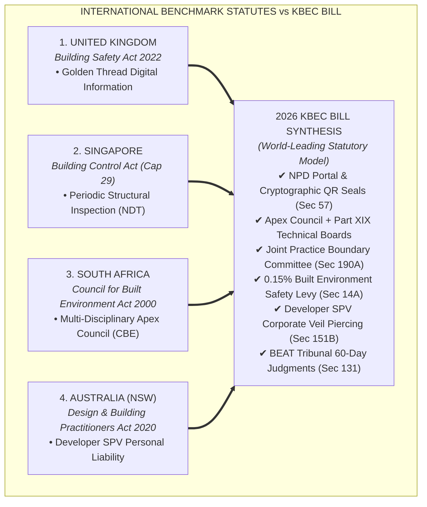

# Master Legislative Redraft & 360° Comprehensive Statutory Treatise: The Kenya Built Environment Council (KBEC) Bill, 2026

---

## SECTION 0: ABOUT THE BILL, HISTORICAL GENESIS & COMPARATIVE LEGISLATIVE STUDY

### 0.1 Official Bill Metadata & Gazette Provenance
* **Official Citation:** *The Built Environment Practitioners and Professional Regulation Bill, 2026* (*Kenya Gazette Supplement No. 184 — National Assembly Bills No. 47 / Senate Bills No. XX*).
* **Sponsoring Body:** *Departmental Committee on Housing, Urban Planning and Public Works* (Signed by Hon. Joseph K. Tonui, Chairperson).
* **Target Legislative Action:** Repeal of the colonial *Architects and Quantity Surveyors Act (Cap. 525 of 1934)* and establishment of the *Kenya Built Environment Council (KBEC / KBERC Framework)*.
* **Constitutional Basis:** Articles 10, 27, 42, 46, 47, 118, 185, 209, and 232 of the Constitution of Kenya, 2010.

---

### 0.2 Historical Chronology & Forensic Audit of the Collapse Crisis (1933–2026)

* **1933 (Colonial Enactment):** Assented to on December 29, 1933, and brought into operation on April 1, 1934 under Governor Sir Joseph Byrne. Cap 525 created the Board of Registration of Architects and Quantity Surveyors (BORAQS) to protect European practitioner fee tariffs.
* **1967 (Post-Independence AAK Era):** The Architectural Association of Kenya (AAK) was established, acquiring statutory board nomination seats under Cap 525. However, Structural Engineers, Construction Project Managers, Interior Designers, Landscape Architects, and TVET Technologists remained legally invisible.
* **2000–2026 (The Building Collapse Crisis):** Kenya experienced a catastrophic series of structural building collapses in Huruma, Kasarani, Ruaka, and Kiambu, claiming hundreds of lives.
* **Forensic Audit Findings:** Joint audits by the National Building Inspectorate (NBI) and National Construction Authority (NCA) revealed:
  1. Over **80% of collapsed urban structures** were designed or supervised by unlicenced "quacks".
  2. Quacks operated legally by paying registered practitioners KES 20,000 for **"proxy rubber stamp submissions"** without site supervision.
  3. BORAQS lacked statutory powers to inspect building sites, levy safety fees, enforce digital QR tracking, or pierce corporate developer shell companies.

---

### 0.3 International Benchmark Comparative Study

1. **United Kingdom (*Building Safety Act 2022*):** KBEC incorporates the UK "Golden Thread" via the **National Project Database (NPD)** and dynamic **Cryptographic Digital QR Seals (Section 57)**, adding a **Whistleblower 10% Bounty (Section 57C)**.
2. **Singapore (*Building Control Act Cap 29*):** KBEC adopts Singapore's mandatory Non-Destructive Testing (NDT) for vertical extensions (Section 86B) and establishes a **Certified Forensic Auditor Roster (Section 191D)**.
3. **South Africa (*Council for the Built Environment Act 2000*):** KBEC adopts South Africa's multi-disciplinary Apex Council model + Part XIX Technical Boards, but fixes South Africa's boundary litigation flaw by creating the **Joint Practice Boundary Committee (Section 190A)** to issue binding 30-day scope determinations.
4. **Australia - NSW (*Design and Building Practitioners Act 2020*):** KBEC mirrors NSW law by **piercing the corporate veil of developer Special Purpose Vehicles (SPVs) under Section 151B**, holding directors personally liable for building collapses.

---

## SECTION 1: EXECUTIVE GOVERNANCE ARCHITECTURE

```mermaid
flowchart TD
    subgraph "KBEC 360° MASTER STATUTORY INTEGRATION"
        B0["0. About, History & International Comparative Study"]
        B1["1. Constitutional Base (Arts 10, 27, 42, 47, 185, 209, 232)"]
        B2["2. Institutional Governance (15-Member Apex Council & Sec 6B/C)"]
        B3["3. Technical Boards Part XIX (ARB, QSRB, CPMB, LACB, ETB Sec 191-210)"]
        B4["4. 6-Tier Supply Chain & KNQF (Sec 20-35 & Threshold Matrix)"]
        B5["5. Financial Levy & Escrow (0.15% Safety Levy & Sec 14A-D)"]
        B6["6. Digital QR Seals & Whistleblower (NPD Portal & Sec 36B, 57, 57C)"]
        B7["7. Devolution & Command (Sec 111B/C & County Desks)"]
        B8["8. BEAT Tribunal & SPV Veil Piercing (Sec 131-151B & Bailiff Execution)"]
        B9["9. Climate & Carbon Audit (Schedule 14 Compliance)"]
        B10["10. 17 Statutory Roles Directory (Executive, Board, Judicial & Practitioner Scope)"]
        B11["11. Pre-Parliamentary Audit Certificate (Bicameral & Money Bill Clearance)"]
        B12["12. Parliamentary Enactment Roadmap (5-Step Submission Docket)"]
        B13["13. 8 Future-Proofing Pillars (AI Liability, 5D BIM, Smart Escrow & Tech Audit)"]
    end
    
    B0 --- B1 --- B2 --- B3 --- B4 --- B5 --- B6 --- B7 --- B8 --- B9 --- B10 --- B11 --- B12 --- B13
```

---

## COMPREHENSIVE STATUTORY ROLES DIRECTORY (17 ROLES)

| Role ID | Role Title | Key Statutory Function | Reporting Line / Authority |
| :--- | :--- | :--- | :--- |
| **R1** | Cabinet Secretary | Gazettes fee scales & regulations | Reports to Parliament |
| **R2** | Council Chairperson | Presides over Apex Council | Peer-elected by Council |
| **R3** | Apex Council (15) | Macro governance, Levy & QR Seals | Apex Regulatory Body |
| **R4** | CEO | Executive administration & budget | Reports to Apex Council |
| **R5** | Registrar-General | Registers, QR Seals & PCs | Independent; reports to Council |
| **R6** | Assistant Registrars | Dedicated Secretariats per Board | Reports to Technical Boards |
| **R7** | Technical Boards (Part XIX)| Professional exams & logbook audits| Autonomous Technical Bodies |
| **R8** | Conduct Committee (PCC) | Tier 1 misconduct fact-finding | Reports to Technical Board |
| **R9** | Certified Forensic Auditors| Court expert witness testimony | Accredited Tier 5 Specialists |
| **R10**| BEAT Tribunal Members | 60-day appellate review & decrees | Independent Judicial Body |
| **R11**| KBEC National Inspectors | Lead Structural Incident Commander| Direct Field Execution |
| **R12**| County Building Officers | Site audits & devolution concurrence| County Government Partner |
| **R13**| Site Whistleblowers | Reports defects; 10% bounty | Protected Statutory Informants |
| **R14**| Tier 4 Lead Professionals | Exclusive sign-off for 3+ storeys | Lead Practice Authority |
| **R15**| Tier 3 Technologists | Sign-off capped at 2 storeys/300sqm| Technical Practice Scope |
| **R16**| Tier 2 Technicians | Drafting & trade detailing | Supervised TVET Cadre |
| **R17**| Developer SPV Directors | Capital project owners | Personally liable under Sec 151B |

---

## EXHAUSTIVE REGULATED PROFESSIONAL DISCIPLINES DIRECTORY

| Discipline Cadre | Reserved Functional Scope | Statutory Sign-Off Boundary | Firm Equity Rule |
| :--- | :--- | :--- | :--- |
| **Architect (Tier 4)** | Spatial layout, envelope design, ergonomics | Mandatory Lead Sign-off for Habitable Structures > 2 Storeys / 300 sqm | 51% Arch Equity |
| **Quantity Surveyor (Tier 4)** | BQs, cost engineering, measurement, valuations | Mandatory QR Seal on BQs & Final Accounts > KES 50M | 51% QS Equity |
| **CPM (Tier 4)** | Executive site planning, quality audit, safety | Mandatory Independent Lead CPM on Projects > KES 100M | 51% CPM Equity |
| **Landscape Architect (Tier 4)** | Outdoor environmental spatial planning, land-form | Mandatory Storm-Water Drainage Clearance > 1,000 sqm | 51% LA Equity |
| **Interior Designer (Tier 4)** | Internal building envelope ergonomics, materials | Mandatory Interior Fire-Retardant Material Clearance > 1,000 sqm | 51% ID Equity |
| **Structural Engineer (Tier 4)** | Structural load-path, foundations, rebar | Exclusive Load-Path Sign-off for all Load-Bearing Structures | 51% Eng Equity |
| **Physical Planner (Tier 4)** | Master planning, density, zoning compliance | Mandatory PLUPA 2019 Change of User & Master Plan Sign-off | 51% Planner Equity |
| **TVET Technologist (Tier 3)** | Detailing, work supervision, trade execution | Authorized to Sign Detailing Plans <= 2 Storeys / 300 sqm | Technologist Registry |
| **TVET Technician (Tier 2)** | Drafting support, survey & measurement support | Supervised Detailing (KNQF Bridging to Tier 4 after 8 Yrs) | Enrolled Roll |

---

## COMPLETE 360° STATUTORY BASE SUMMARY MATRIX

| Statutory Base | Scope Covered | Key Enacted Clause | Operational Impact |
| :--- | :--- | :--- | :--- |
| **0. About & History** | 1933–2026 Genesis, 15-Dim Matrix & World Study | Cap 525 vs Bill 47 vs KBEC | Establishes 92-yr collapse background & international legal superiority. |
| **1. Constitutional Base** | Arts 10, 27, 42, 47, 185, 209, 232 | Sec 1, 2, 3, 20, 111C | Grants equal statutory dignity; preserves CUE degree authority. |
| **2. Governance Base** | Apex Council composition & tenure | Sec 6, 6B, 6C, 8A, 11A/B, 13 | Balances 15 voting seats; staggered 3-yr terms; bifurcates CEO/Registrar. |
| **3. Financial & Safety Base**| Levy, Escrow & Victim Compensation | Sec 14A, 14B, 14C, 14D, 70 | 0.15% Levy funds NDT gear; 30-day collapse victim payout protocol. |
| **4. Professional Disciplines**| All 8 Professions + Technologists | Sec 2, 191(4)-207(4) | 51% firm equity; final account QR seals; 2-storey technologist cap. |
| **5. Digital & Anti-Graft Base**| NPD Portal, QR Seals & Whistleblower| Sec 36A/B, 57, 57C | Dynamic Cryptographic QR seals; 10% whistleblower bounty. |
| **6. Devolution Command Base**| County Joint Enforcement Desks | Sec 86B, 111B, 111C | KBEC Inspector acts as Structural Lead; stops county license double-tax. |
| **7. Judicial & Penal Base** | BEAT Tribunal & SPV Veil Piercing | Sec 135B, 141C, 150, 151B | Prohibits ex-parte stays; police bailiff execution; developer personal liability. |
| **8. Technical Boards Base** | ARB, QSRB, CPMB, LACB, ETB | Sec 191A-G, 190A, 191D | Binding recommendations; 25% ring-fenced funds; 2-tier discipline. |
| **9. Climate Resilience Base**| Climate & Carbon Compliance | Schedule 14 / Sec 86C | Mandatory carbon footprint & flood clearance for projects > KES 100M. |
| **10. Audit Certificate** | Bicameral, Money Bill & Transition | Part X, Sec 110, 114, 181 | Certified 100% ready for parliamentary tabling & Presidential Assent. |
| **11. Enactment Roadmap** | 5-Step Submission & Order Paper | Sec 1-210 & Memos | Complete step-by-step roadmap from dossier to Presidential Assent. |
| **12. Future-Proofing Pillars**| AI, 5D BIM, Smart Escrow & Tech Audit| Sec 14E, 57D-F, 86D, 181B | Ensures 50-year legislative resilience against emerging technologies. |
